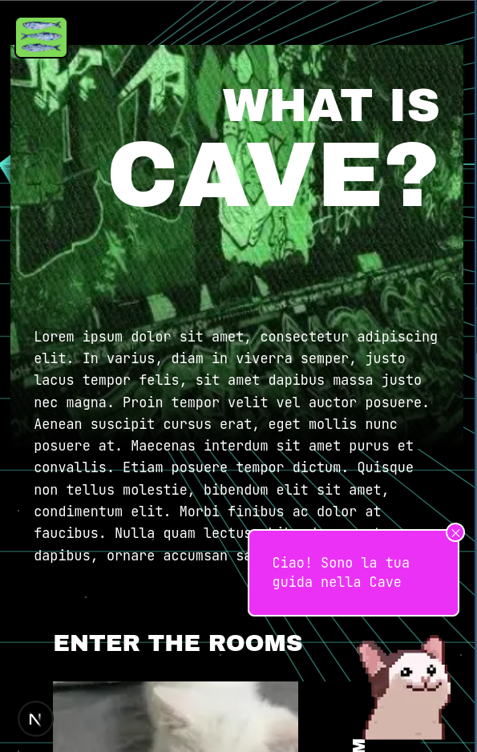
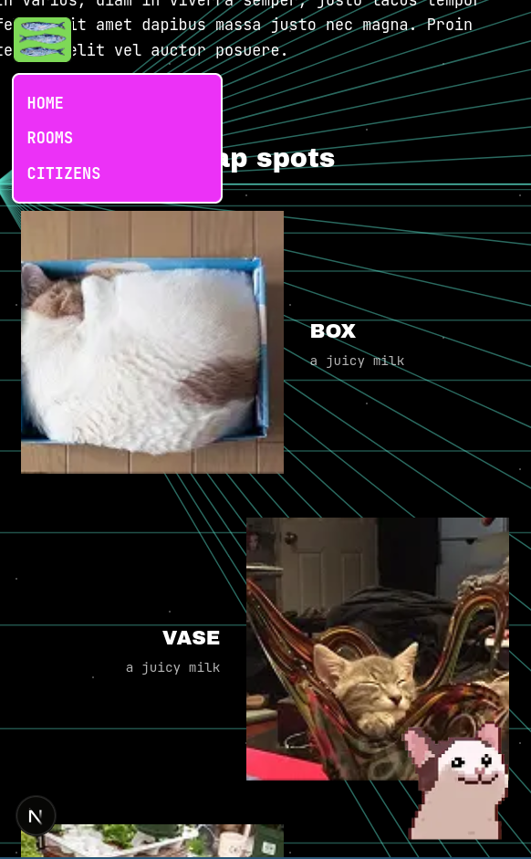
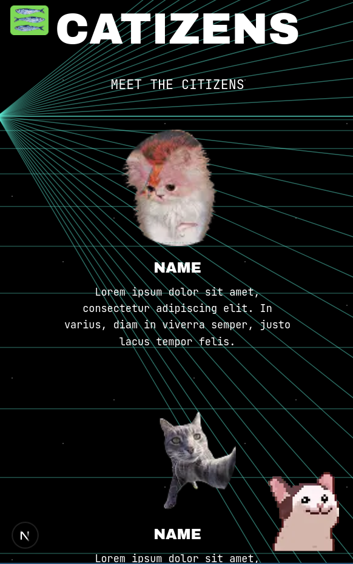

# Cat Cave

                _                       
                \`*-.                   
                 )  _`-.                
                .  : `. .               
                : _   '  \              
                ; *` _.   `*-._         
                `-.-'          `-.      
                  ;       `       `.    
                  :.       .        \   
                  . \  .   :   .-'   .  
                  '  `+.;  ;  '      :  
                  :  '  |    ;       ;-.
                  ; '   : :`-:     _.`* ;
         [bug] .*' /  .*' ; .*`- +'  `*'
               `*-*   `*-*  `*-*'     

> A playful web experience exploring the hidden world of cats — one room at a time.

**Cat Cave** is an experimental web app inspired by the idea of imagining what a secret society of cats might look like.

The website takes the form of a virtual **cat cave**, where visitors can explore different rooms, meet its feline citizens, discover their rituals, listen to their purrs, and find out what they like to eat.

The project is intentionally playful, interactive, and constantly evolving. Some areas are still under construction and new features will be added over time.

---

## Features

### Mobile-First & Responsive

Cat Cave is designed with a **mobile-first approach**, while providing a fully responsive experience across both **mobile and desktop devices**.

The interface and interactions are designed to adapt to different screen sizes, preserving the playful and immersive experience of the Cat Cave regardless of the device used.


### Home

The homepage acts as the main entrance to the Cat Cave.

It provides an overview of the different rooms and introduces the cave's citizens, giving visitors multiple paths to start exploring.

---

### Nap Rooms

A collection of cozy rooms inhabited by sleepy cats.

Each cat can be interacted with by clicking on them, triggering their individual **purring sounds**.

The room is designed to encourage playful exploration rather than simply presenting static content.

---

### Worship Room

A glimpse into the spiritual side of cat society.

Here you can discover the **entities and figures worshipped by the cats**, presented as part of the fictional mythology of the Cat Cave.

---

### Food Room

Every civilization needs food.

The Food Room contains a collection of the **cats' favourite recipes**, giving visitors a glimpse into the culinary traditions of the Cat Cave.

---

### Catizens

Meet the citizens of the Cat Cave.

The Catizens page presents the different feline inhabitants and gives them a dedicated space within the cave's world.

---

### Rave Room

The Cat Cave is not all naps and worship.

The Rave Room is a playful space featuring **embedded TikTok videos of cats partying**, bringing a more chaotic and contemporary side to the cave.

---

### Guide Cat

A small **guide cat is fixed at the bottom of the screen** throughout the website.

Clicking on the guide cat reveals tips and suggestions to help visitors discover different parts of the cave and find things they might otherwise miss.

Think of it as your personal feline tour guide.

---

## Architecture

The project is built around a **component-based architecture**, with an emphasis on reusable UI elements across the different rooms.

Instead of treating each page as an isolated experience, common elements are shared across the application.

Examples include:

* Room previews
* Footer
* Guide Cat
* Reusable page sections
* Cat-related UI components
* Interactive elements

This structure makes it easier to introduce new rooms and features without duplicating existing UI logic.

---

## Tech Stack

* **React**
* **Next.js**
* **TypeScript**
* **Tailwind CSS**
* **ESLint**

The application uses **Next.js** as its React framework and is structured to support the gradual addition of new interactive experiences.

---

## Getting Started

### Prerequisites

Make sure you have **Node.js** and **npm** installed.

### Installation

Clone the repository and install the dependencies:

```bash
npm install
```

### Development

Start the local development server:

```bash
npm run dev
```

The application will be available at:

```text
http://localhost:3000
```

### Production Build

Create a production build:

```bash
npm run build
```

Then start the production server:

```bash
npm run start
```

### Lint

Run ESLint with:

```bash
npm run lint
```

---

## 📸 Screenshots

### Home

<!-- Add homepage screenshot here -->



### Nap Rooms

<!-- Add Nap Rooms screenshot here -->



### Worship Room

<!-- Add Worship Room screenshot here -->


### Catizens

<!-- Add Catizens screenshot here -->



### Rave Room

<!-- Add Rave Room screenshot here -->


---

## Design & Concept

Cat Cave started as a **UI/UX concept by [pinte_rest]**.

The visual direction, interactions, and ideas behind the experience originate from the designer's concepts. New features and rooms are developed iteratively from these ideas.

The development process can therefore be described as a collaboration between **design and implementation**, with the code serving as the technical layer that brings the concepts to life.

> *The designer comes up with the cave. I make the cats work.*

---

## Credits

### Concept & UI/UX

**pinte_rest**

The original concept, visual direction, UX ideas, and feature concepts behind Cat Cave.

### Development

**Technical implementation**

Responsible for translating the design concepts into a working Next.js / React application, building reusable components, implementing interactions, and maintaining the technical architecture.

### Creators & Sources

Creators of external content used throughout the Cat Cave are **credited and tagged wherever their work appears**.

This includes external media such as the TikTok videos embedded in the Rave Room.

---

## Project Status

**Work in progress.**

Cat Cave is an evolving project rather than a finished product.

Some sections currently contain placeholders, while other features are still being designed or implemented. The architecture has been intentionally kept flexible so that new rooms, interactions, characters, and experiences can be introduced over time.

Planned evolution may include:

* New rooms
* More Catizens
* AI guide cat
* Additional interactive elements
* More sounds and animations
* Expanded cat mythology
* New guide cat interactions
* Additional content and recipes

The cave is still growing. 

---

## Project Structure

The project follows a component-oriented approach, with reusable UI pieces shared between the different pages.

A simplified view of the architecture:

```text
cat_cave-app/
├── app/
│   ├── page.tsx
│   ├── nap-rooms/
│   ├── worship-room/
│   ├── food-room/
│   ├── catizens/
│   └── rave/
│
├── components/
│   ├── GuideCat/
│   ├── RoomPreview/
│   ├── Footer/
│   └── ...
│
├── public/
│   ├── images/
│   ├── audio/
│   └── ...
│
├── package.json
└── README.md
```

The exact structure may evolve as the project grows.

---

## Explore the Cave

Cat Cave is an experiment in combining **UI/UX, storytelling, interaction, and playful web development** into a small fictional world.

There is no particular reason why cats need a cave.

They just do.

And apparently, they have been waiting for you to visit.

**Welcome to the Cat Cave.**
